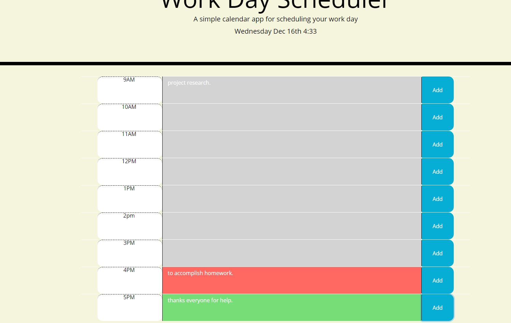

# work-day-scheduler
# Table of Contents
- [Description](#Description)
- [Technologies](#Technologies)
- [Installation](#Installation)
- [Usage](#Usage)
- [Deployment](#Deployment)
- [Screenshots](#Screenshots)
# Description 
Work Day Scheduler is a simple app allows user to enter specific notes for a particular day os the time so that user can keep track of what need to be accomplish in that particular day. The main important feature of this app is that it shows the different color for the different period of time (present, past and future) 
# Technologies 
- HTML
- CSS
- JavaScript
- Brouser Local storage
# Installation 
- Clone the git hub repo.
# Usage
- navigate to the `ondex.html` page and open in browser. 
# Deployment
 - [link to deployed page](https://ghimirear.github.io/work-day-scheduler/)
# Screenshoots
 
